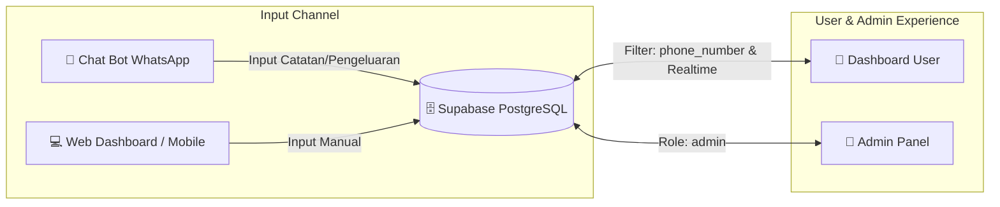

<div align="center">

# ⚡ Wasap Daily Hub
### *Modern Executive Daily Workspace, Ideas Backlog & Expense Tracker*

[](https://nextjs.org/)
[](https://react.dev/)
[](https://tailwindcss.com/)
[](https://supabase.com/)

**Wasap Daily Hub** adalah platform produktivitas harian all-in-one berbasis **Next.js 14**, **Tailwind CSS**, dan **Supabase**. Dirancang dengan arsitektur **Multi-User terisolasi per Nomor WhatsApp** dan antarmuka **Executive Dark Glassmorphism** yang elegan, responsif, dan realtime.

</div>

---

## 🌟 Fitur Utama

### 1. 📱 Multi-User & WhatsApp Data Isolation (Multi-Tenancy)
* **Pemisahan Data Otomatis**: Setiap catatan tugas, ide, dan pengeluaran terisolasi per nomor WhatsApp (`phone_number`).
* **Satu Database untuk Semua Teman**: Aman digunakan bersama tanpa risiko data tertukar antar pengguna.
* **Auto-Formatting**: Nomor HP lokal (`0812...`) otomatis dikonversi ke format internasional (`62812...`).

### 2. 🔐 Sistem Autentikasi & Admin Control Panel
* **Login Fleksibel**: Masuk menggunakan *Username* atau *Nomor WhatsApp* + *Password*.
* **Keamanan Password**: Menggunakan SHA-256 Web Crypto hashing.
* **👑 Admin Control Panel (`/admin`)**:
  * Monitoring total pengguna, total tugas, dan total transaksi global.
  * Manajemen pengguna (ubah role Admin/User, tautan chat langsung ke WhatsApp, hapus akun).

### 3. 📊 Executive Glassmorphism UI & Realtime Sync
* **Live Dynamic Stats**: Progress bar penyelesaian tugas harian, counter total pengeluaran Rupiah, dan hitungan backlog ide.
* **Supabase Realtime**: Sinkronisasi data otomatis saat ada input baru dari Web maupun bot WhatsApp tanpa perlu reload browser.
* **Indonesian Live Clock**: Jam dan tanggal Bahasa Indonesia bergerak dinamis per detik.

### 4. 🧩 3 Pilar Workspace Harian
* **✅ Tugas Hari Ini (*Today's Tasks*)**:
  * Filter tab: *Semua*, *Belum Selesai*, *Selesai*.
  * Animated checklist dengan efek strike-through dan hapus tugas.
* **💡 Draft & Ide Backlog (*Brain Dump*)**:
  * Wadah menampung ide dan rencana kasar sebelum dieksekusi.
  * Tombol aksi **`⚡ Jadwalkan Hari Ini`** (1-klik memindahkan draft ke tugas aktif hari ini).
* **💸 Catat Pengeluaran (*Expense Tracker*)**:
  * Pilihan kategori cepat (🍔 Makan, 🚗 Transport, 🛍️ Belanja, ⚡ Tagihan, 📝 Lainnya).
  * Quick amount chips (`+10k`, `+25k`, `+50k`, `+100k`) untuk pengisian nominal secepat kilat.
  * Riwayat transaksi harian dengan format mata uang Rupiah (`id-ID`).

---

## 🔄 Arsitektur Alur Kerja



---

## 🛠️ Tech Stack

* **Framework**: [Next.js 14](https://nextjs.org/) (App Router, Client Components, Server-Ready)
* **Library**: [React 18](https://react.dev/)
* **Styling**: [Tailwind CSS](https://tailwindcss.com/) + Custom Glassmorphism & Ambient Glows
* **Database & Realtime**: [Supabase](https://supabase.com/) (`@supabase/supabase-js`)
* **Typography**: Plus Jakarta Sans (Google Fonts)

---

## 🚀 Panduan Memulai (Quick Start)

### 1. Clone Repository & Install Dependensi
```bash
git clone https://github.com/noyatata5-debug/wasap.git
cd wasap
npm install
```

### 2. Konfigurasi Environment Variable
Salin template [.env.example](file:///.env.example) menjadi `.env.local`:
```bash
cp .env.example .env.local
```

Isi kredensial Supabase Anda di `.env.local`:
```env
NEXT_PUBLIC_SUPABASE_URL=https://your-project.supabase.co
NEXT_PUBLIC_SUPABASE_ANON_KEY=your_supabase_anon_key
```

### 3. Setup Database Supabase
Buka **Supabase Dashboard** > **SQL Editor**, lalu salin dan jalankan seluruh query dari file [schema.sql](file:///schema.sql):

```sql
-- 1. Buat Tabel Users
CREATE TABLE IF NOT EXISTS public.users (
  id BIGINT GENERATED BY DEFAULT AS IDENTITY PRIMARY KEY,
  username TEXT UNIQUE NOT NULL,
  phone_number TEXT UNIQUE NOT NULL,
  password_hash TEXT NOT NULL,
  role TEXT DEFAULT 'user',
  created_at TIMESTAMPTZ DEFAULT NOW()
);

-- 2. Tambahkan kolom phone_number ke tasks & expenses
ALTER TABLE public.tasks ADD COLUMN IF NOT EXISTS phone_number TEXT;
ALTER TABLE public.expenses ADD COLUMN IF NOT EXISTS phone_number TEXT;

-- 3. Buat Index pencarian cepat
CREATE INDEX IF NOT EXISTS idx_tasks_phone ON public.tasks(phone_number);
CREATE INDEX IF NOT EXISTS idx_expenses_phone ON public.expenses(phone_number);
CREATE INDEX IF NOT EXISTS idx_users_phone ON public.users(phone_number);
CREATE INDEX IF NOT EXISTS idx_users_username ON public.users(username);
```

### 4. Jalankan Development Server
```bash
npm run dev
```
Buka [http://localhost:3000](http://localhost:3000) di browser Anda.

---

## 📂 Struktur Direktori

```text
wasap/
├── app/
│   ├── admin/
│   │   └── page.jsx        # Halaman Admin Control Panel
│   ├── login/
│   │   └── page.jsx        # Halaman Login & Registrasi Akun
│   ├── globals.css         # Styling global, Glassmorphism, dan Ambient Grid
│   ├── layout.jsx          # Root Layout & Metadata
│   ├── page.jsx            # Main Dashboard (Daily Workspace, Tasks & Expenses)
│   └── providers.jsx       # AuthProvider context wrapper
├── lib/
│   ├── authContext.jsx     # Logika Auth, Session, Normalisasi No WA, dan Hashing
│   └── supabase.js         # Inisialisasi client Supabase
├── schema.sql              # Migration script database PostgreSQL
├── tailwind.config.mjs     # Konfigurasi kustom tema Tailwind
├── .env.example            # Contoh variabel lingkungan
└── package.json            # Dependensi dan script project
```

---

## 📄 Lisensi
Project ini dibuat untuk kebutuhan personal & produktivitas tim. Bebas dikembangkan dan dimodifikasi sesuai kebutuhan!
